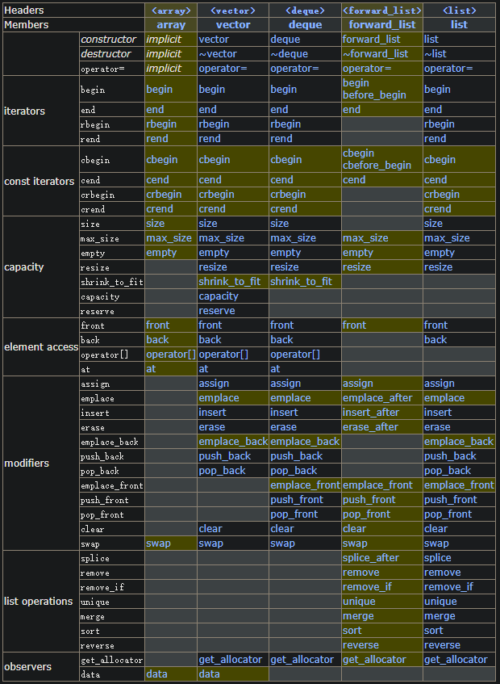
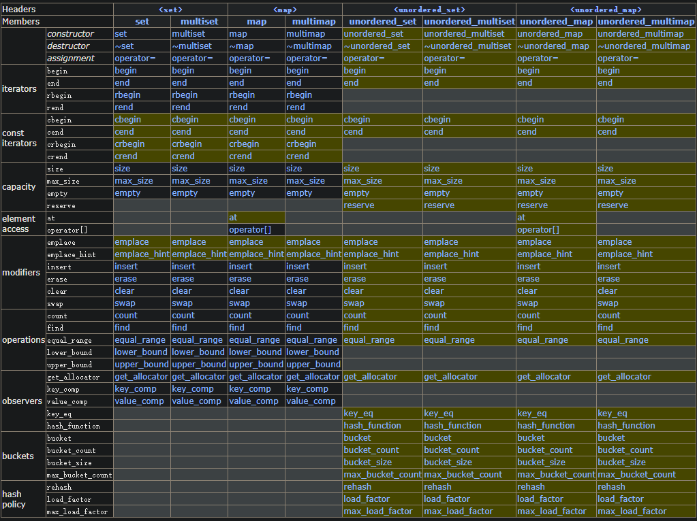

# 简介

C++标准模板库(STL)主要包含容器和算法。  
其中容器主要分为：
- 序列容器：vecotr, array, list, deque, string
- 容器适配器：stack, queue, priority_queue(堆实现)
- 排序的关联容器(红黑树实现)：map, set, multimap, multiset
- 无序关联容器（哈希函数实现）：unordered_map, unordered_set, unordered_multimap, unordered_multiset

算法主要分类以下几类：
- 只读序列算法： for_each, find, count...
- 可变序列算法: copy, replace, fill, remove, reverse...
- 排序相关算法: sort, merge, max, min...
- 其他: next_permutation...

# 容器
序列容器主要成员函数  

关联容器主要成员函数  

# 算法（algorithm）
## 只读算法

| **类型** | **函数名** | **说明** |
| --- | --- | --- |
| 循环 | for_each() | 对序列中的每个元素执行某操作。 |
| 查找 | find() | 在序列中找出某个值的第一次出现的位置。 |
|  | find_if() | 在序列中找出符合某谓词的第一个元素。 |
|  | find_end()| 在序列中找出一子序列的最后一次出现的位置 |
||search()| 在序列中找出一子序列的第一次出现的位置|
||search_n()| Find succession of equal values in range. |
|  | find_first_of() | 在序列中找出第一次出现指定值集中之值的位置。 |
|  | adjacent_find() | 在序列中找出相邻的一对值。 |
| 计数 | count() | 在序列中统计某个值出现的次数。 |
|  | count_if() | 在序列中统计与某谓词匹配的次数。 |
| 比较 | mismatch() | 找出两个序列相异的第一个元素
||equal() | 比较两个序列是否相等 |

## 可变序列算法

| **类型** | **函数名** | **说明** |
| --- | --- | --- |
| 复制 | copy() | 从序列的第一个元素起进行复制。 |
|  | copy_backward() | 从序列的最后一个元素起进行复制。 |
| 交换 | swap() | 交换两个元素。 |
|  | swap_ranges() | 交换指定范围的元素。 |
|  | iter_swap() | 交换由迭代器所指的两个元素。 |
| 变换 | transform() | 将某操作应用于指定范围的每个元素。 |
| 替换 | replace() | 用一个给定值替换一些值。 |
|  | replace_if() | 替换满足谓词的一些元素。 |
|  | replace_copy() | 复制序列时用一给定值替换元素。 |
|  | replace_copy_if() | 复制序列时替换满足谓词的元素。 |
| 填充 | fill() | 用一给定值取代所有元素。 |
|  | fill_n() | 用一给定值取代前n个元素。 |
| 生成 | generate() | 用一操作的结果取代所有元素。 |
|  | generate_n() | 用一操作的结果取代前n个元素。 |
| 删除 | remove() | 删除具有给定值的元素。 |
|  | remove_if() | 删除满足谓词的元素。 |
|  | remove_copy() | 复制序列时删除具有给定值的元素。 |
|  | remove_copy_if() | 复制序列时删除满足谓词的元素。 |
| 唯一 | unique() | 删除相邻的重复元素。 |
|  | unique_copy() | 复制序列时删除相邻的重复元素。 |
| 反转 | reverse() | 反转元素的次序。 |
|  | reverse_copy() | 复制序列时反转元素的次序。 |
| 环移 | rotate() | 循环移动元素。 |
|  | rotate_copy() | 复制序列时循环移动元素。 |
| 随机 | random_shuffle() | 采用均匀分布来随机移动元素。 |
| 划分 | partition() | 将满足某谓词的元素都放到前面。 |
|  | stable_partition() | 将满足某谓词的元素都放到前面并维持原顺序。 |

## 排序相关算法

| **类型** | **函数名** | **说明** |
| --- | --- | --- |
| 排序 | sort() | 以很好的平均效率排序。 |
|  | stable_sort() | 排序，并维持相同元素的原有顺序。 |
|  | partial_sort() | 将序列的前一部分排好序。 |
|  | partial_sort_copy() | 复制的同时将序列的前一部分排好序。 |
| 第n个元素 | nth_element() | 将第n各元素放到它的正确位置。 |
| 二分检索 | lower_bound() | 找到大于等于某值的第一次出现。 |
|  | upper_bound() | 找到大于某值的第一次出现。 |
|  | equal_range() | 找到（在不破坏顺序的前提下）可插入给定值的最大范围。 |
|  | binary_search() | 在有序序列中确定给定元素是否存在。 |
| 归并 | merge() | 归并两个有序序列。 |
|  | inplace_merge() | 归并两个接续的有序序列。 |
| 有序结构的集合操作 | includes() | 一序列为另一序列的子序列时为真。 |
|  | equal() |  |
|  | mismatch() |  |
|  | set_union() | 构造两个集合的有序并集。 |
|  | set_intersection() | 构造两个集合的有序交集。 |
|  | set_difference() | 构造两个集合的有序差集。 |
|  | set_symmetric_difference() | 构造两个集合的有序对称差集（并-交）。 |
| 堆操作 | push_heap() | 向堆中加入元素。 |
|  | pop_heap() | 从堆中弹出元素。 |
|  | make_heap() | 从序列构造堆。 |
|  | sort_heap() | 给堆排序。 |
| 最大和最小 | min() | 两个值中较小的。 |
|  | max() | 两个值中较大的。 |
|  | min_element() | 序列中的最小元素。 |
|  | max_element() | 序列中的最大元素。 |
| 词典比较 | lexicographical_compare() | 两个序列按字典序的第一个在前。 |
| 排列生成器 | next_permutation() | 按字典序的下一个排列。 |
|  | prev_permutation() | 按字典序的前一个排列。 |

# 其他
## 头文件numeric
|||
|-|-|
| accumulate | 累积运算 |
| adjacent_difference | 计算邻接差 |
| inner_product | 计算内积|
| partial_sum | 计算部分和|
| iota | 用递增序列赋值|